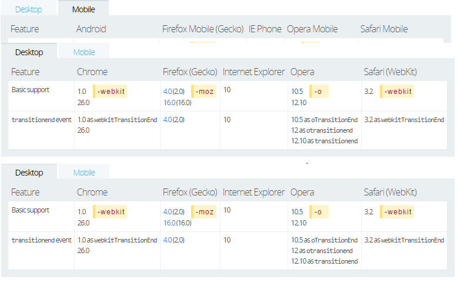

#CSS3新功能推荐及优化

## transtion
> CSS 过渡（transition）, 是 CSS3 规范的一部分,可以让属性的变化过程持续一段时间，而不是立即生效，将按一个曲线速率变化，这个过程是可以自定义。比如，将元素的高度从0%变为100%，将元素的颜色由白色变为黑色等。

> 通常将两个状态之间的过渡称为隐式过渡 implicit transitions ，因为开始与结束之间的状态由浏览器自行决定。

> 过渡可以决定哪些属性发生动画效果 (明确地列出这些属性)，何时开始 (设置 delay), 持续多久 (设置 duration) 以及如何动画 (定义timing函数，比如匀速地或先快后慢)。

#### 语法：
> transition是简写属性，有以下四个属性值：
```
    transition ： [<'transition-property'> || <'transition-duration'> || <'transition-timing-function'> || <'transition-delay'> [, [<'transition-property'> || <'transition-duration'> || <'transition-timing-function'> || <'transition-delay'>]]*
    伪css：
    div {
        transition: <property> <duration> <timing-function> <delay>;
    }
```

>- transition-property：执行变换的属性
    - 当其值为none时，transition马上停止执行
    - 当指定为all时，则元素产生任何属性值变化时都将执行transition效果
    - ident是可以指定元素的某一个属性值。其对应的类型：color(background-color,border-color,color等), length(width,height,top,padding,margin等)和transform等
- transition-duration：变换持续的时间
- transition-timing-function：在延续时间段，变换的速率变化
    - 可用属性: ease | linear | ease-in | ease-out | ease-in-out | cubic-bezier(<number>, <number>, <number>, <number>)
    
    - cubic-bezier为通过贝赛尔曲线来计算“转换”过程中的属性值
- transition-delay：变换延迟时间
    - 当改变元素属性值后多长时间开始执行transition效果
    - 改变多个css属性的transition效果，可以有各自不同的延续时间和其时间的速率变换方式；
    - transition-delay与transition-duration的值都是时间，所以要区分它们在连写中的位置，一般浏览器会根据先后顺序决定，transition-duration | transition-delay；
    
#### 相关事件
> 
检测过渡是否完成，在符合标准的浏览器下，这个事件是 transitionend, 在 WebKit 下是 webkitTransitionEnd。
- propertyName: 字符串，指示已完成过渡的属性。
- elapsedTime: 浮点数，指示当触发这个事件时过渡已运行的时间（秒）。这个值不受 transition-delay 影响。
- 如果取消了过渡则不会触发 transitionend 事件。

#### 注意事项：
>
- 目前，各大浏览器（包括IE 10）都已经支持无前缀的transition，所以transition已经可以很安全地不加浏览器前缀。兼容性表格如下：

- 不是所有的CSS属性都支持transition，完整的列表查看[这里](http://oli.jp/2010/css-animatable-properties/)，以及具体的效果。
- transition需要明确知道，开始状态和结束状态的具体数值，才能计算出中间状态。比如，height从0px变化到100px，transition可以算出中间状态。但是，transition没法算出0px到auto的中间状态，也就是说，如果开始或结束的设置是height: auto，那么就不会产生动画效果。类似的情况还有，display: none到block，background: url(foo.jpg)到url(bar.jpg)等等。
- 同时应当留意这种情形，在插入元素（如 .appendChild()）或改变属性 display: none 后立即使用过渡, 元素将视为没有开始状态，始终处于结束状态。简单的解决办法，改变属性前用 window.setTimeout() 延迟几毫秒。

#### 局限：
> transition的优点在于简单易用，但是它有几个很大的局限。
- transition需要事件触发，所以没法在网页加载时自动发生。
- transition是一次性的，不能重复发生，除非一再触发，请使用animation。
- transition只能定义开始状态和结束状态，不能定义中间状态，也就是说只有两个状态。CSS的animation可以解决这个问题，能够指定动画的多个中间状态。

##animation

## border-radius
> border-radius 用来设置边框圆角。当使用一个半径时确定一个圆形；当使用两个半径时确定一个椭圆，这个(椭)圆与边框的交集形成圆角效果。

> 

> 这是一个简写属性，用来设置 border-top-left-radius, border-top-right-radius, border-bottom-right-radius ，border-bottom-left-radius。
> 和其他简写属性类似，无法为个别值设定为继承，如 border-radius:0 0 inherit inherit，这会覆盖一部分现有定义。在这种情况下只能使用完整属性来指定。

## box-shadow

## text-outline

##text-shadow

## multiple backgrounds

## background-size

## text-overflow

## Flexible Box Model

=============
[@bryan](https://github.com/saviroyu)
